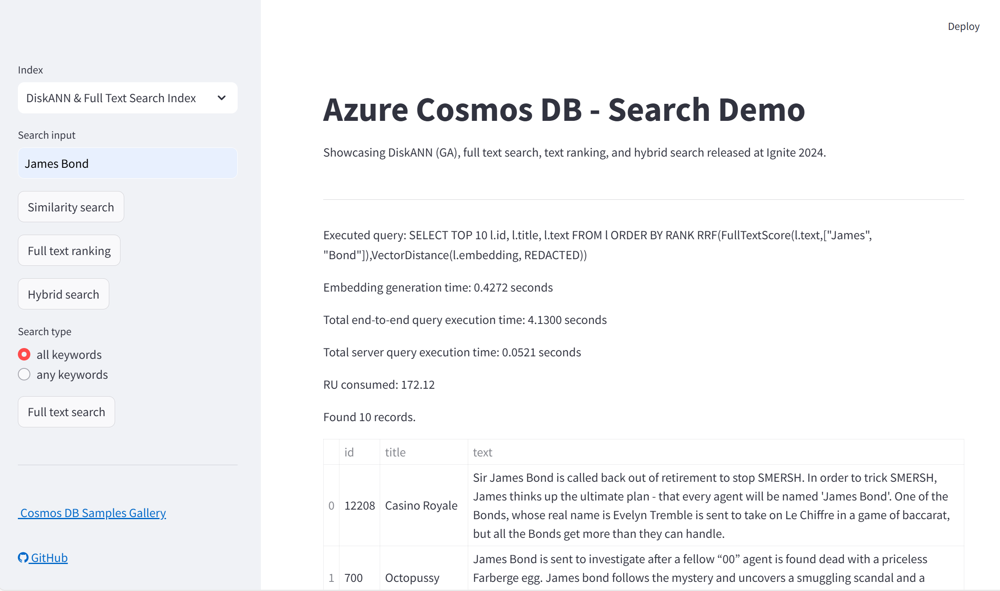

# Ignite 2024 Search Demo with Azure Cosmos DB.

This repository contains a Python Streamlit application that allows users to search for movies using semantic search powered by OpenAI embeddings and Azure Cosmos DB. The application includes vector search, full text search, text ranking, and hybrid search. Three containers with no index, qflat, and DiskANN indexes are created. 



## Features

- Integration with Azure Cosmos DB for storing and querying
  - Semantic search for movies using OpenAI embeddings.
  - Full text search for movies.
  - Hybrid search combining semantic and full text search.
  - Text ranking for search results.
- Support for different indexes (No Index, Qflat Index, DiskANN Index).
- Interactive UI built with Streamlit.

## Prerequisites

- [Azure Cosmos DB](https://azure.microsoft.com/services/cosmos-db/) account with NoSQL API.
- [Azure OpenAI](https://azure.microsoft.com/products/ai-services/openai-service) account.

## Run the application locally

1. **Clone the repository and navigate to the folder**:
   ```sh
   git clone https://github.com/AzureCosmosDB/BRK193-Ignite2024.git
    cd BRK193-Ignite2024/cosmos-search-demo
   ```

1. **Create file name ".env" in the "app" folder, and update with required environment variables for Azure Cosmos DB and Azure OpenAI**

   ```sh
   AZURE_OPENAI_APIKEY=
   AZURE_OPENAI_ENDPOINT=
   AZURE_COSMOSDB_ENDPOINT=
   AZURE_COSMOSDB_KEY=
   ```
   
1. **Install the required packages**:
   ```sh
   pip install -r requirements.txt
   ```
   
2. **Run the Streamlit application**:
   ```sh
    streamlit run src/app/cosmos-app.py
    ```

## Deploy the application to Azure with vscode

1. **Install the Azure App Service extension**:
   - Open the Extensions view by clicking on the square icon in the Sidebar.
   - Search for "Azure App Service" and click on the Install button.

2. **Deploy the application**:
   - create [Azure Web App](https://learn.microsoft.com/azure/app-service/overview) with Linux service plan (choose B1 SKU or higher), and Python 3.10.
   - In App Service go to configuration and paste the following in the `Startup Command` field:
     ```shell 
     python -m pip install requirements.txt
     python -m streamlit run src/app/cosmos-app.py --server.port 8000 --server.address 0.0.0.0
     ```
   - Ctrl + Shift + P and select "Azure App Service: Deploy to Web App"
      1. Select this folder on your machine
      2. Select subscription
      3. Select the Azure Web App you created above.
   - Wait until app deployed (can take up to 5 minutes).

## Loading vectors into the containers

1. The app will create the containers with required vector and text search policies and indexes. You need to load the data into the containers separately.
2. The `data-loader.py` script is provided in the `src/data` folder. You can run this script for any data as long as it is a json array of documents with a unique `id` field, and a field of any name containing text to be vectorized. You can also use an existing vectorized field, or re-embed that field using OpenAI embeddings if necessary. The below command will load the Movie Lens dataset into 3 containers in a database called `ignite2024demo` (created by the streamlit app above), re-embedding the `overview` field and re-naming it `text`, also naming the embedding field `embedding` to match the streamlit app, and discarding the existing `vector` embedding field.
    ```sh
    python src/data/data-loader.py --text_field_name "overview" --path_to_json_array "https://raw.githubusercontent.com/microsoft/AzureDataRetrievalAugmentedGenerationSamples/refs/heads/main/DataSet/Movies/MovieLens-4489-256D.json" --database_name "ignite2024demo" --concurrency 20 --vector_field_name "vector" --re_embed True
    ```

   
